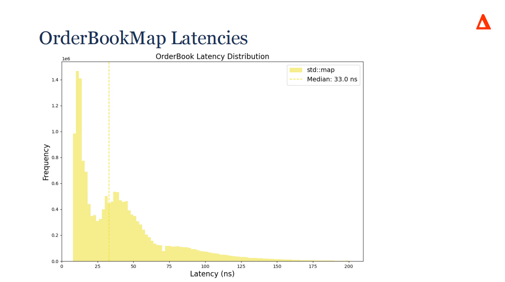
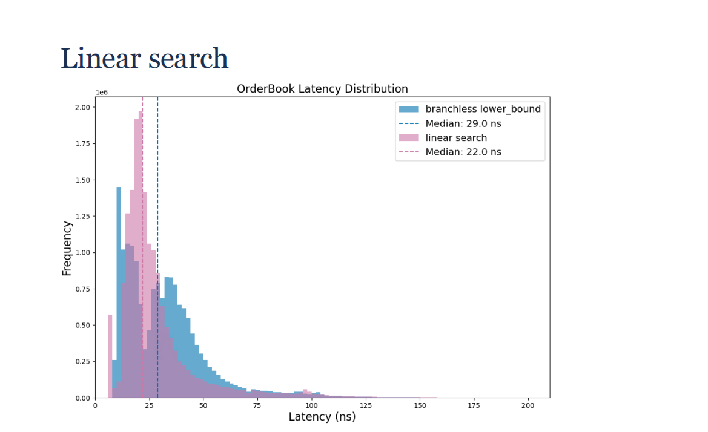
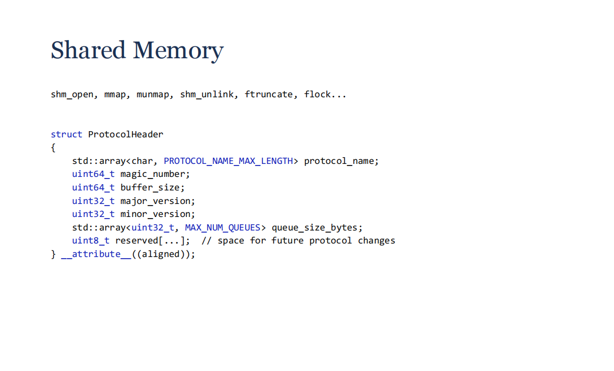
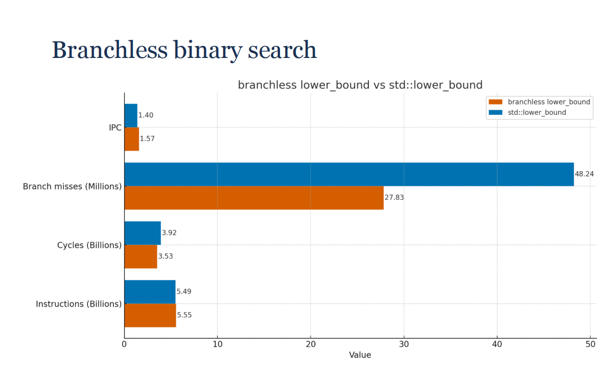
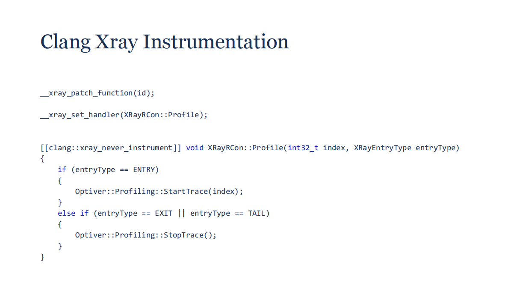

# 🐎 Pegasus — High-Frequency Trading System

> *Named after the winged horse of Greek mythology — built for speed, precision, and endurance.*


---

## 📌 Overview

**Pegasus** is a production-grade, latency-critical trading system designed for the **cryptocurrency market**, built with **Modern C++ (C++17/20)** principles. It spans the full stack from raw market data ingestion to order execution, with engineering decisions grounded in low-level systems knowledge: cache topology, lock-free concurrency, branchless algorithms, and invasive performance profiling.

The system is designed to be **iterative and inheritable** — strategies are codified into tested, version-controlled components that can be evolved without losing institutional knowledge.

> 📄 Core design philosophy is derived from and documented in: **[Nanosecond-level Ultrafast Trading System (UTS) design strategies](https://github.com/Witnessing-Miracles/Ns-Level_UTS_Design_Strategies/blob/main/doc/Nanoseconds-Level_Ultrafast_Trading_Systems_in_C%2B%2B.md)** — an engineering synthesis of David Gross's CppCon 2024 presentation *"When Nanoseconds Matter: Ultrafast Trading Systems in C++"*, authored by Peter Wayne (Peile Wu).

---

## 🏗️ System Architecture

```
┌────────────────────────────────────────────────────────────────┐
│                        Pegasus System                          │
│                                                                │
│  ┌─────────────┐    SHM Queue       ┌──────────────────────┐   │
│  │ Market Feed │ ───(lock-free)──▶ │   Strategy Engine    │   │
│  │  (Producer) │                    │  (Consumer × N)      │   │
│  └─────────────┘                    └──────────┬───────────┘   │
│                                                │               │
│                                     ┌──────────▼───────────┐   │
│                                     │   Order Execution    │   │
│                                     │   + Risk Control     │   │
│                                     └──────────────────────┘   │
│                                                                │
│  IPC: Shared Memory  |  No kernel involvement on hot path      │
└────────────────────────────────────────────────────────────────┘
```

Each major component runs as an **independent process**. A crash in one strategy process does not cascade to the execution or feed layer — a critical design constraint for any system managing real assets.

---

## ⚡ Performance Engineering Philosophy

Pegasus adopts the "loser's game" philosophy from market making: there is **no single silver bullet**. Consistent, systemic excellence across every layer — data structures, memory layout, concurrency, networking, profiling — is what creates durable performance.

> *"It's not about this one Silver Bullet that's going to allow you to beat the market; you need to be constantly good at everything."*
> — David Gross, CppCon 2024

This means every design decision in Pegasus is justified by **measurement**, not intuition.

---

## 📦 Core Data Structure: The Order Book

### Evolution: `std::map` → `std::vector` → Flat Array

The order book is the heart of the system. Its implementation went through a deliberate, measured evolution:

#### Stage 1 — `std::map` (Rejected)

`std::map` (red-black tree) gives `O(log N)` insert/delete/lookup and stable iterators — attractive on paper. In practice, its **node-based heap allocation** causes pointer chasing across disparate memory addresses, generating severe cache misses on hot paths.

**Measured result:** Under simulated memory fragmentation (realistic in long-running processes), `std::map` median latency doubles — from ~33ns to ~63ns. This is unacceptable.


*Figure: std::map latency distribution under memory fragmentation.*

#### Stage 2 — `std::vector` + `std::lower_bound` (Intermediate)

`std::vector` guarantees **contiguous memory**, enabling the CPU to load cache lines efficiently. Binary search via `std::lower_bound` gives `O(log N)` lookup.

However: insertion and deletion require element shifting — `O(N)`. More critically, profiling with `perf record` revealed that **over 30% of CPU time** was spent on conditional jumps inside `std::lower_bound` due to branch mispredictions (market data is inherently unpredictable, defeating the branch predictor).

#### Stage 3 — Flat Array + Branchless Linear Search (Current Design)

For small, hot price-level arrays (typically < 20 active levels on each side), **linear scan outperforms binary search** due to:
- Sequential memory access → perfect cache prefetcher behavior
- No branch mispredictions
- No "fat tail" in latency distribution

```cpp
// Branchless linear search over contiguous price levels
// Eliminates conditional jump overhead identified by perf topdown analysis
alignas(64) std::array<PriceLevel, MAX_LEVELS> bid_levels;
alignas(64) std::array<PriceLevel, MAX_LEVELS> ask_levels;
```


*Figure: Linear search over flat array — narrow, consistent latency with no fat tail.*

**Design summary:**

| Implementation | Complexity | Cache | Branch Predict | Verdict |
|---|---|---|---|---|
| `std::map` | `O(log N)` | ❌ Poor | ✅ Good | ❌ Rejected |
| `std::vector` + `lower_bound` | `O(log N) + O(N)` | ✅ Good | ❌ Poor | ⚠️ Intermediate |
| Flat array + linear scan | `O(N)` | ✅ Excellent | ✅ Excellent | ✅ Current |

---

## 🔗 Inter-Process Communication: Lock-Free Shared Memory Queue

Traditional sockets and OS IPC mechanisms involve context switches and kernel involvement — unacceptable on the hot path. Pegasus uses a **lock-free shared memory queue** for all inter-process communication.

### Design

```
┌────────────────────────────────────────────────────────┐
│              Shared Memory Segment                     │
│                                                        │
│  [Header: magic | version_major | version_minor]       │
│  [write_counter]  ←── producer only writes             │
│  [read_counter]   ←── producer writes, consumers read  │
│  [data ring buffer: variable-length messages]          │
└────────────────────────────────────────────────────────┘
```

**Key design decisions:**

- **Single producer** increments `write_counter` to reserve space, copies data, then increments `read_counter` to publish. Consumers only read both counters — no write contention.
- **False sharing prevention**: `write_counter` and `read_counter` each occupy a dedicated, `alignas(64)` cache line.
- **Batch reservation**: Producer reserves blocks (e.g., 100KB at a time) rather than incrementing the atomic counter per message, reducing atomic operation frequency by ~1000×.
- **Copy semantics, not pointers**: Variable-length messages are copied directly into the ring buffer. Passing raw pointers across process boundaries is unsafe and architecturally incorrect.
- **Fan-out pattern**: Multiple strategy consumers read the same market data stream — each gets a full copy, enabling independent strategy isolation.
- **Protocol versioning**: Shared memory header includes magic number + major/minor version to prevent silent misinterpretation when the protocol evolves or when a stale process opens the wrong segment.


*Figure: Lock-free shared memory queue with dual-counter design.*

---

## 🛠️ Concurrency Model

Pegasus avoids `std::mutex` on all hot paths. The concurrency model is built on three layers:

### 1. Process Isolation (Coarse Grain)
Each strategy and each system component (feed, execution, risk) runs as a separate OS process. A segfault in one strategy cannot corrupt another's state. Shared memory provides zero-copy data sharing without entangling process lifetimes.

### 2. Lock-Free Queue (Medium Grain)
The SHM queue described above handles all cross-process messaging with no mutex — purely atomic counter operations and memory fences.

### 3. Cache-Line Discipline (Fine Grain)
Structs that are modified by different threads/cores are padded to prevent **false sharing** (two independent variables sitting on the same 64-byte cache line, causing invisible coherence traffic):

```cpp
struct alignas(64) QueueHead {
    std::atomic<uint64_t> write_counter;
    char _pad1[64 - sizeof(std::atomic<uint64_t>)];

    std::atomic<uint64_t> read_counter;
    char _pad2[64 - sizeof(std::atomic<uint64_t>)];
};
```

---

## 🔬 Hot Path Code Quality

### Lambdas over `std::function`

`std::function` uses type erasure, introducing virtual dispatch and preventing inlining. On hot paths, all callbacks use templated lambdas, preserving full compiler visibility for inlining and optimization.

```cpp
// ❌ Avoid: type erasure kills inlining
std::function<void(const MarketUpdate&)> handler;

// ✅ Prefer: compiler can inline and optimize
template<typename Handler>
void on_update(const MarketUpdate& update, Handler&& handler) {
    handler(update);
}
```

### IIFE for Cold Path Isolation

Error handling, logging, and fallback paths are wrapped in **Immediately Invoked Function Expressions (IIFEs)** to prevent the compiler from inlining cold code into hot instruction cache lines:

```cpp
// Cold path (error handling) isolated from hot path I-Cache
auto handle_error = [&]() __attribute__((noinline)) {
    log_and_recover(ctx);
};

if (__builtin_expect(error_condition, 0)) {
    handle_error();
}
```

### `[[likely]]` / `[[unlikely]]` Annotations

Branch prediction hints are applied at all known-skewed branches to guide compiler code layout:

```cpp
if ([[likely]] order_valid) {
    process_order(order);
} else [[unlikely]] {
    reject_order(order);
}
```

---

## 📏 Performance Profiling & Measurement

> *"If you care about performance, you must measure it."* — David Gross, CppCon 2024

Pegasus uses a layered profiling stack. Intuition is never trusted without data.

### Layer 1 — `perf` Top-Down Micro-architectural Analysis

Intel's four-category top-down model is used to identify the class of bottleneck before diving into code:

| Category | What it reveals | Example finding |
|---|---|---|
| **Instruction Retire** | % of cycles doing useful work | Baseline efficiency |
| **Bad Speculation** | Branch misprediction cost | Found in `std::lower_bound` — 30%+ cycles wasted |
| **Front-End Bound** | I-Cache misses, decode stalls | Cold code bleeding into hot I-Cache |
| **Back-End Bound** | Memory latency, execution unit stalls | `std::map` cache miss penalty |

```bash
# Top-down analysis
perf stat --topdown -a -- ./pegasus_feed

# Hotspot sampling
perf record -g ./pegasus_feed && perf report
```

### Layer 2 — Hardware Counters via `libpapi`

For benchmark regression testing, `libpapi` provides programmatic access to hardware performance counters with near-zero overhead, enabling precise quantification of optimizations:

```cpp
// Measure cache misses and IPC directly in benchmark harness
PAPI_read(event_set, before);
run_benchmark();
PAPI_read(event_set, after);
// Compare: branch mispredictions, L1/L2 misses, instructions per cycle
```

**Measured result (branchless vs branching binary search):**
- Branch mispredictions: reduced by ~80%
- IPC: improved from **1.4 → 1.57**


### Layer 3 — TSC Invasive Profiling (Event Loop)

For nanosecond-resolution timing of specific code sections within the event loop, **RDTSC** (Read Time-Stamp Counter) is used. RDTSC is a single instruction with ~20-cycle overhead — orders of magnitude cheaper than `clock_gettime()`:

```cpp
struct ScopeTimer {
    uint64_t start;
    const char* label;
    ScopeTimer(const char* l) : label(l), start(__builtin_ia32_rdtsc()) {}
    ~ScopeTimer() {
        uint64_t elapsed = __builtin_ia32_rdtsc() - start;
        LatencyHistogram::record(label, elapsed);
    }
};

// Usage: drops ~20 cycles of overhead, sub-nanosecond resolution
{
    ScopeTimer t("order_book_update");
    book.apply(market_event);
}
```

### Layer 4 — Clang XRay (Production Profiling)

For production systems where instrumentation cannot be compiled in/out manually, **Clang XRay** inserts compile-time hooks (no-ops by default) that can be activated dynamically without recompilation. This enables zero-overhead production tracing on demand:

```bash
# Compile with XRay instrumentation hooks (no-ops at runtime by default)
clang++ -fxray-instrument -fxray-instruction-threshold=1 pegasus.cpp

# Activate tracing in a live process without recompile
XRAY_OPTIONS="patch_premain=true xray_logfile_base=xray-log." ./pegasus
```


*Figure: Clang XRay dynamic tracing — production-ready, zero overhead by default.*

---

## 🌐 Networking: Kernel Bypass (Reference Architecture)

While Pegasus targets cryptocurrency exchanges (which do not enforce co-location or FPGA requirements), the networking layer is designed with kernel bypass principles as a reference ceiling:

| Transport Layer | Mechanism | Typical UDP Latency |
|---|---|---|
| Standard kernel socket | OS network stack | ~10µs |
| OpenOnload (Solarflare) | User-space socket interception | ~1–2µs |
| Intel DPDK | Direct NIC access, user-space | ~500ns–1µs |
| Layer 2 API (EF_VI) | Raw Ethernet frame level | ~700ns (AMD Zen4) |

Current Pegasus deployment uses standard sockets. The architecture is designed so that swapping in a kernel-bypass transport (DPDK or OpenOnload) requires changes only at the feed ingestion boundary — all downstream components are transport-agnostic.

---

## 🧰 Technology Stack

| Component | Choice | Rationale |
|---|---|---|
| **Core language** | C++17/20 | Zero-cost abstractions, full hardware control |
| **Strategy research** | Python (pandas, ccxt, Jupyter) | Fast iteration for backtesting |
| **Market data source** | Historical tick data / Exchange WebSocket | Highest resolution input |
| **Profiling** | `perf`, `libpapi`, TSC, Clang XRay | Layered, scientific measurement |
| **IPC** | Lock-free shared memory queue | Zero kernel involvement post-setup |
| **Build system** | CMake + Clang | XRay support, LTO, PGO-compatible |
| **Target market** | Cryptocurrency exchanges (overseas) | 24/7 operation, T+0 settlement |

---

## 📐 Design Principles (Adapted from David Gross, CppCon 2024)

| Principle | Application in Pegasus |
|---|---|
| **No silver bullet** | Every optimization is measured before and after |
| **Minimize OS involvement** | Hot path: no syscalls, no allocations, no locks |
| **Data locality over algorithmic complexity** | Flat array beats `std::map` despite worse O() |
| **Simple is fast** | Components are small, single-responsibility, easy to reason about |
| **Sustaining speed is harder than achieving it** | CI benchmarks alert on latency regressions |
| **Empathy — think about the whole system** | Cache line layout decisions consider all cores sharing the bus |

---

## 📚 Reference

- **[Nanosecond-level Ultrafast Trading System (UTS) design strategies](https://github.com/Witnessing-Miracles/Ns-Level_UTS_Design_Strategies/blob/main/doc/Nanoseconds-Level_Ultrafast_Trading_Systems_in_C%2B%2B.md)** — Peter Wayne (Peile Wu). Engineering synthesis of David Gross's CppCon 2024 talk.
- [When Nanoseconds Matter: Ultrafast Trading Systems in C++ — David Gross, CppCon 2024](https://www.youtube.com/watch?v=sX2nF1fW7kI)
- [Trading at light speed: designing low latency systems in C++ — David Gross](https://www.youtube.com/watch?v=8uAw5FQtcvE)
- [What Every Programmer Should Know About Memory — Ulrich Drepper](https://people.freebsd.org/~lstewart/articles/cpumemory.pdf)
- [Data-Oriented Design and C++ — Mike Acton, CppCon 2014](https://www.youtube.com/watch?v=rX0ItVEVJHc)

---

*Pegasus — fly fast, trade smart.* 🐎
