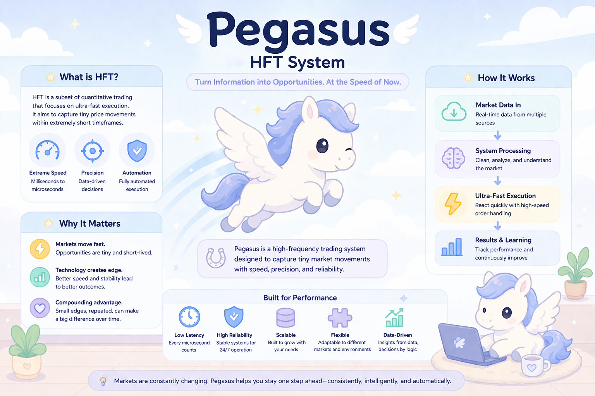

# 🐎 Pegasus — High-Frequency Trading System

> *Named after the winged horse of Greek mythology — built for speed, precision, and endurance.*



---

## 📌 What Is This Project?

**Pegasus** is a real-world, production-grade High-Frequency Trading (HFT) system designed primarily for the **cryptocurrency market**. It is built with **Modern C++** design principles and supports multi-frequency trading strategies — from low-frequency position trading all the way down to millisecond-level execution.

The system is engineered to be **iterative and inheritable** — once a strategy is codified into the system, it can be continuously refined, upgraded, and passed on to future collaborators without losing institutional knowledge.

---

## 🧭 Where Does HFT Fit in the Trading Landscape?

Not all trading is the same. Here's a simple map of how different trading styles relate to each other:

```
Programmatic Trading
└── Algorithmic Trading        (smart order execution)
    └── Quantitative Trading   (math + statistics-driven)
        └── High-Frequency Trading  ← Pegasus lives here
```

| Style | Description |
|---|---|
| **Programmatic Trading** | Any trade executed by a computer program (officially defined in China since Oct 2024) |
| **Algorithmic Trading** | Uses algorithms to split large orders and minimize market impact |
| **Quantitative Trading** | Derives strategies from historical data using statistics and mathematical models |
| **High-Frequency Trading** | Sub-second to microsecond execution; profits from tiny, rapid price movements |

---

## ⚡ What Makes HFT Different?

HFT is a *subset* of quantitative trading with one defining characteristic: **speed is the edge**.

- Trade holding periods range from **a few minutes down to microseconds**
- Orders may be placed and cancelled within **nanoseconds** just to probe market depth
- Profits come from **exploiting tiny price fluctuations**, not long-term market trends
- Strategies run **fully automated** — no human intervention after deployment

> 💡 Think of HFT less like investing and more like a **chess engine playing 10,000 games per second** — each move is tiny, but the cumulative edge adds up.

---

## 🏗️ Core Technical Requirements for HFT

### 1. 🕐 T+0 Settlement
HFT **requires** a T+0 (Trade Date + 0 days) settlement mechanism:

```
Buy  → Position credited instantly → Can sell the same day
Sell → Cash credited instantly     → Can buy again the same day
```

Without T+0, a high-frequency strategy simply cannot execute multiple round-trips in a single session. This is why **crypto markets are ideal** — they operate 24/7 with instant settlement.

### 2. 💸 Ultra-Low Transaction Fees
Every HFT trade captures a razor-thin margin. Transaction costs must be **minimal** — even a fraction of a basis point matters when you're executing thousands of trades per day.

### 3. ⚙️ Hardware & Software Speed
| Layer | Technique | Latency |
|---|---|---|
| Standard internet | Regular brokerage API | ~50ms |
| Co-location | Server hosted in exchange's own data center | ~50µs |
| FPGA | Strategy logic burned into hardware chips | ~nanoseconds |

> 🔌 **Co-location** means physically placing your trading server *inside the exchange's data center* — paying rent to be as close as possible to the matching engine. Every extra kilometer of fiber adds ~5 microseconds of latency.

---

## 🌊 The Problem HFT Solves: Market Impact

Imagine you need to sell **60,000 shares** between $10.00 and $10.60.

| Strategy | Approach | Problem |
|---|---|---|
| ❌ Naive | Dump all 60,000 at market price | Crashes the price below $10 immediately |
| ✅ Algorithmic | Split into smaller orders across price levels | Hidden, low-impact, optimal fill |
| ✅ Weighted | Concentrate volume at favorable prices | Maximizes average execution price |

Algorithmic order splitting solves three things:
- 📉 **Reduces market impact** — avoids moving the price against yourself
- 💰 **Lowers transaction cost** — better average fill price
- 🕵️ **Conceals intent** — large players can trade without tipping off the market

---

## 🌑 Dark Pools (Advanced Concept)

A **dark pool** is a private, off-exchange trading venue where prices are *not publicly displayed* until after a trade is executed. Originally developed in US markets, they are designed for:

- **Large institutional orders** that would move the market if exposed
- Breaking massive single orders into smaller, anonymous transactions
- Executing "behind the curtain" to avoid front-running

---

## 🧠 The Shifting Trading Paradigm

> *"Information that once took months to be priced in now travels the globe in minutes."*

The trading world is evolving fast:

```
Old World                        New World
─────────────────────────────────────────────────
Indicator-based strategies  →   Probability-based models
Manual intuition            →   AI-driven decision engines
Days/weeks holding period   →   Milliseconds to minutes
```

Traditional technical indicators (moving averages, RSI, etc.) are being gradually replaced by **statistical models and machine learning** that adapt in real time.

---

## 📊 Data — The Foundation of Everything

Pegasus relies on **historical tick data** as its primary input for strategy development and backtesting.

> 📌 **Tick data** = every single trade, captured individually — price, volume, timestamp, and direction. It is the highest-resolution market data available.

| Data Source | Speed | Cost |
|---|---|---|
| Purchase historical tick data | ⚡ Fastest | 💰 Paid |
| Export via trading software | 🐢 Slower | Free |
| Open-source data APIs | 🚶 Manual | Free |

---

## 🚀 Pegasus System Highlights

| Feature | Detail |
|---|---|
| **Language** | Modern C++ |
| **Target Market** | Cryptocurrency exchanges (overseas) |
| **Frequency Support** | Low / Mid / High frequency strategies |
| **FPGA / Co-location** | Not required for crypto (exchanges don't enforce it) |
| **Strategy Lifecycle** | Codified → Backtested → Deployed → Iterated |
| **Goal** | Reduce manual workload; let technology drive decisions |

---

## 🔁 Why Build a System Instead of Trading Manually?

- ✅ Strategies are **preserved** as code, not locked in someone's head
- ✅ **Team-accessible** — anyone on the team can read, run, and improve it
- ✅ **Continuously evolvable** — add new strategies, remove old ones, version-control everything
- ✅ Removes emotional decision-making from execution

---

## 🐍 Python Research & Data Environment

Pegasus uses a lightweight Python stack for data acquisition, strategy research, and backtesting. The core tools are:

| Tool / Library | Role | Link |
|---|---|---|
| **Anaconda** | Python environment & package manager | [anaconda.com](https://www.anaconda.com) |
| **Jupyter Notebook** | Interactive research environment | [jupyter.org](https://jupyter.org) |
| **ccxt** | Unified API client for 100+ crypto exchanges | [docs.ccxt.com](https://docs.ccxt.com) |
| **pandas** | Data processing and DataFrame manipulation | [pandas.pydata.org](https://pandas.pydata.org) |

> The Python layer handles market data ingestion and analysis. The core trading engine is written in **Modern C++**.

---

*Pegasus — fly fast, trade smart.* 🐎
