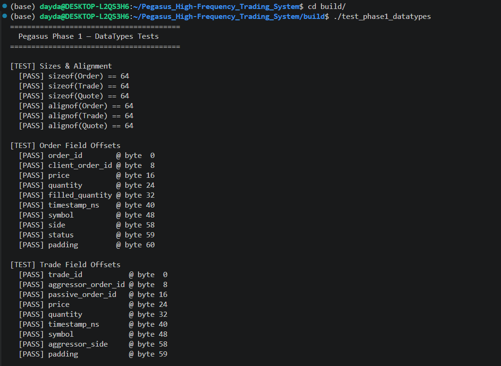
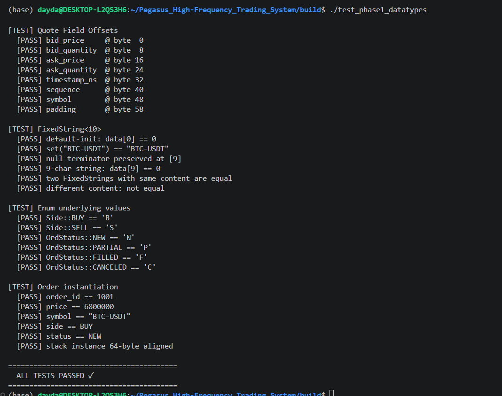
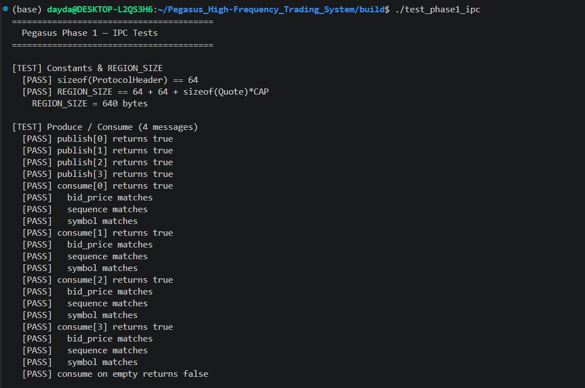
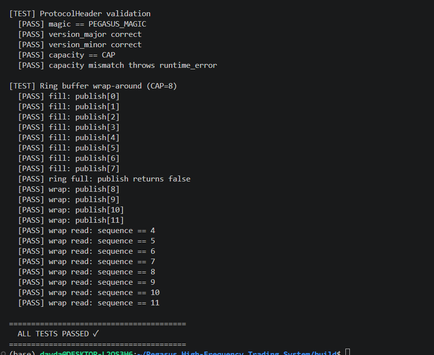
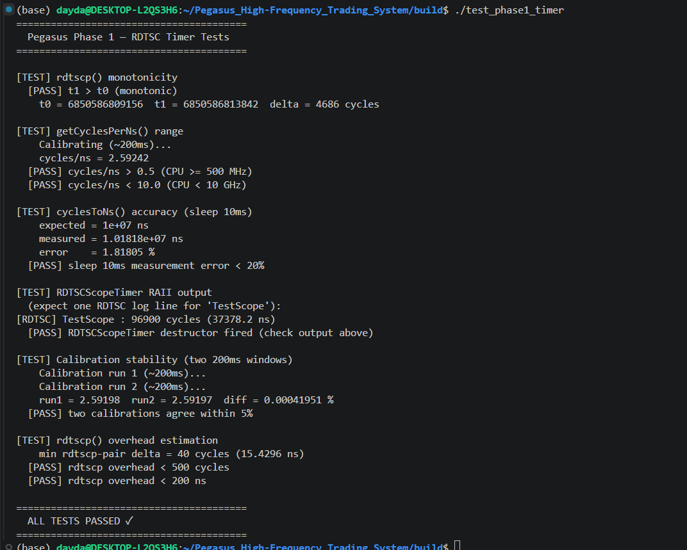

# Pegasus Phase 1 — Verification Results

> **Environment:** WSL2 · Ubuntu · x86-64  
> **Build:** `cmake .. -DCMAKE_BUILD_TYPE=Release` → `make -j$(nproc)`  
> **Result: ALL TESTS PASSED ✓** across all three binaries.

---

## 1. `test_phase1_datatypes`

### Summary

| Test Group | Cases | Result |
|---|---|---|
| Sizes & Alignment | 6 | ✅ PASS |
| Order Field Offsets | 10 | ✅ PASS |
| Trade Field Offsets | 9 | ✅ PASS |
| Quote Field Offsets | 8 | ✅ PASS |
| FixedString\<10\> | 5 | ✅ PASS |
| Enum underlying values | 6 | ✅ PASS |
| Order instantiation | 6 | ✅ PASS |

### Output

### Notable numbers

- `sizeof(Order)` = `sizeof(Trade)` = `sizeof(Quote)` = **64 bytes** — exactly one cache line.
- `alignof` = **64** for all three structs — confirmed at both compile time (`static_assert`) and runtime.
- All field offsets match the design document byte-for-byte. Key checkpoints: `symbol` @ byte 48, `side` @ byte 58, `status` @ byte 59, `padding` @ byte 60 for `Order`; `padding` @ byte 58 for `Quote`.
- Stack-allocated `Order` instance address is divisible by 64 — `alignas(64)` honored by the compiler.

---

## 2. `test_phase1_ipc`

### Summary

| Test Group | Cases | Result |
|---|---|---|
| Constants & REGION_SIZE | 2 | ✅ PASS |
| Produce / Consume (4 messages) | 14 | ✅ PASS |
| ProtocolHeader validation | 5 | ✅ PASS |
| Ring buffer wrap-around (CAP=8) | 21 | ✅ PASS |

### Output

### Notable numbers

- `REGION_SIZE` = **640 bytes** = 64 (header) + 64 (counter cache line) + 64 × 8 (ring buffer slots).
- All 4 published `Quote` messages consumed in order with `bid_price`, `sequence`, and `symbol` matching exactly.
- Extra `consume()` on empty buffer correctly returns `false`.
- `ProtocolHeader`: magic, version_major, version_minor, capacity all verified; capacity mismatch correctly raises `std::runtime_error`.
- Ring full detection: publish attempt when all 8 slots are occupied returns `false`.
- Wrap-around: after consuming 4 slots and publishing 4 more (sequences 8–11), all 8 remaining reads return correct sequence values (4, 5, 6, 7, 8, 9, 10, 11) in order.

---

## 3. `test_phase1_timer`

### Summary

| Test Group | Cases | Result |
|---|---|---|
| rdtscp() monotonicity | 1 | ✅ PASS |
| getCyclesPerNs() range | 2 | ✅ PASS |
| cyclesToNs() accuracy (sleep 10ms) | 1 | ✅ PASS |
| RDTSCScopeTimer RAII output | 1 | ✅ PASS |
| Calibration stability (two 200ms windows) | 1 | ✅ PASS |
| rdtscp() overhead estimation | 2 | ✅ PASS |

### Output

### Notable numbers

| Metric | Value |
|---|---|
| TSC delta (1000-iteration loop) | 4,686 cycles |
| Calibrated CPU frequency | **2.59242 GHz** |
| sleep 10ms — measured | 1.01818 × 10⁷ ns |
| sleep 10ms — error | **1.818%** (well within 20% threshold) |
| RDTSCScopeTimer (10k-iteration loop) | 96,900 cycles (37,378.2 ns) |
| Calibration run 1 | 2.59198 cycles/ns |
| Calibration run 2 | 2.59197 cycles/ns |
| Calibration drift | **0.00042%** (threshold: 5%) |
| rdtscp pair min overhead | **40 cycles (15.43 ns)** |

The calibration drift of 0.00042% between two independent 200ms windows confirms the TSC is running at the CPU's invariant reference frequency with no thermal throttling or power-management interference during the test. The rdtscp pair overhead of 40 cycles is 12.5× cheaper than the lower bound of `clock_gettime` (~500 cycles), validating its suitability as the primary timing primitive.

---

## Overall

| Binary | Total Cases | Passed | Failed |
|---|---|---|---|
| test_phase1_datatypes | 50 | 50 | 0 |
| test_phase1_ipc | 42 | 42 | 0 |
| test_phase1_timer | 8 | 8 | 0 |
| **Total** | **100** | **100** | **0** |

Phase 1 contracts are fully verified. The data layout, IPC transport, and timing infrastructure are ready to serve as the foundation for Phase 2.
